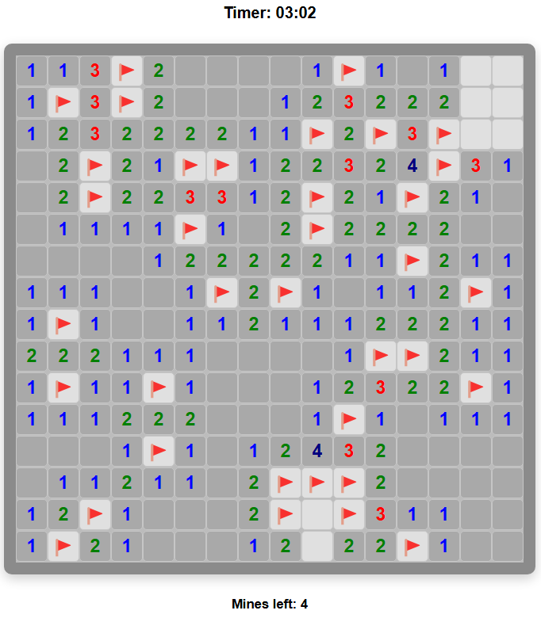
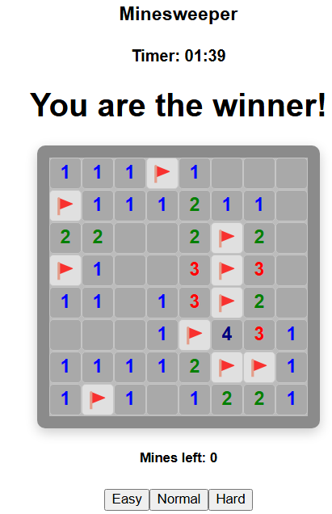
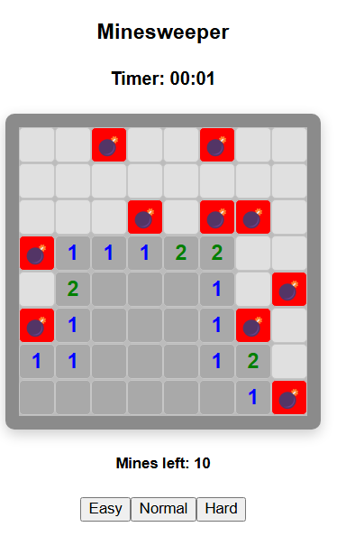
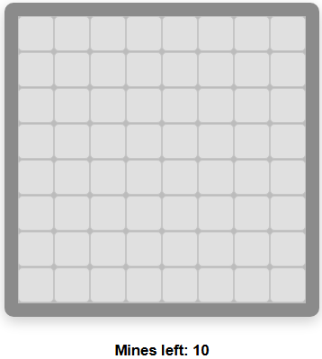
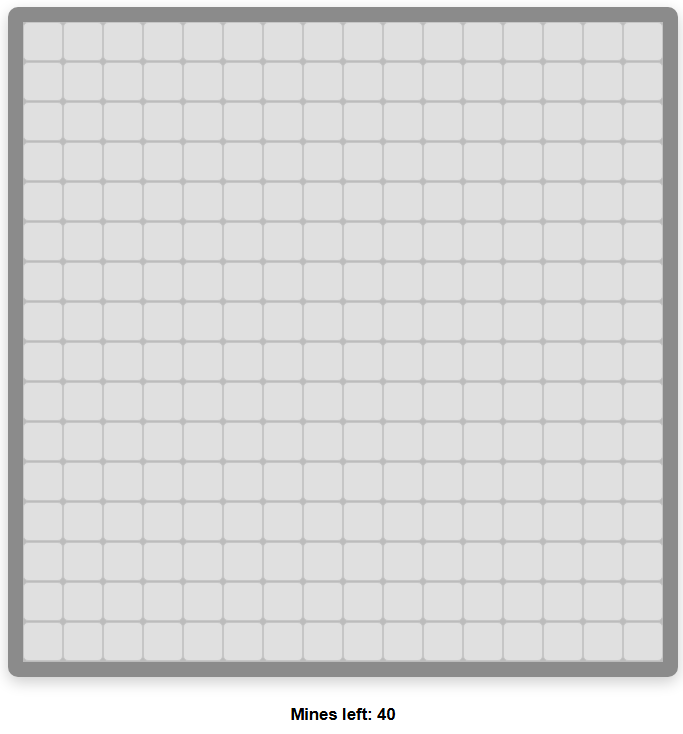
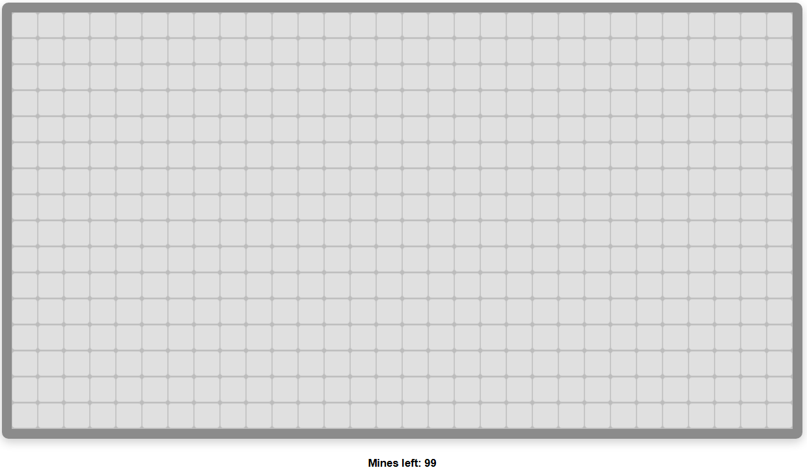

# Minesweeper💣

Minesweeper - це однокористувацька гра, ціль якої позначити всі положення мін, які присутні на карті.
Виконав студент грапи ІМ-11 Щегель Андрій
## Механіка

1. При натисканні ЛКМ по клінинці, розкривається скільки поруч мін, або вибухає міна.
2. При натисканні ПКИ, ставиться прапорець, для позначення присутності міни в клітинці.
3. При натисканні ПКМ на прапорець, він зникає.
4. При подвійному натисканні ЛКМ на клітинку, автоматично розкривються сусідні клітинки.

Для спрацювання подвійного натискання на клітинку, число прапорців повинно дорівнювати числу сусідніх мін

## Вигляд гри

### Вигляд гри в через 3 хв гри

### Вигляд гри після перемоги

### Вигляд гри після влучання в міну

### Різні режими складності

#### Легкий

#### Середній

#### Складний
